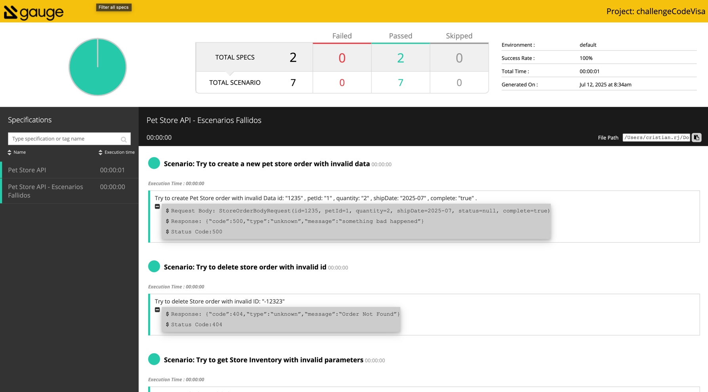

# Automation Project with Gauge and Gradle

This project utilizes the [Gauge](https://gauge.org/) framework for automating tests in Java applications, along with [Gradle](https://gradle.org/) as the build tool. Gauge allows you to write readable test specifications and execute them in multiple languages.

## Table of Contents

- [Requirements](#requirements)
- [Installation](#installation)
- [Project Structure](#project-structure)
- [Writing Specifications](#writing-specifications)
- [Running Tests](#running-tests)
- [Viewing Reports](#viewing-reports)
- [Contributions](#contributions)
- [License](#license)

## Requirements

Before you begin, ensure you have the following installed:

- [Java JDK 8 or higher](https://www.oracle.com/java/technologies/javase-jdk11-downloads.html)
- [Gauge](https://docs.gauge.org/getting_started/installing_gauge.html)
- [Gradle](https://gradle.org/install/) (optional, if you don't have Gradle installed)

## Installation

* **Clone the repository:**

   ```bash
   git clone https://github.com/your_username/project_name.git
   cd project_name
* **Install dependencies:**
   If you are using Gradle, you can install the dependencies by running:

    ```bash
    gradle clean build

* **Install Gauge plugins:**
Make sure to install the necessary plugins for Gauge:
     ```bash
       gauge install java
* **Project Structure**
    ```bash
   `project_name/
   │
   ├── specs/                  # Test specifications
   │   ├── example.spec        # Example specification
   │   └── another_example.spec # Another specification
   │
   ├── src/                    # Source code
   │   └── main/
   │       └── java/
   │           └── com/
   │               └── example/
   │                   └── MyStepImplementation.java  # Step implementation
   │
   ├── build.gradle            # Gradle configuration file
   └── README.md               # This file`
  
* **Running Tests**
    ```bash
    gauge run specs/

## Viewing Reports

After running the tests, you can find the reports in the `reports/` directory. The reports will include detailed information about the test execution, including passed and failed tests.

**To view the report, simply open the `index.html` file located in the `reports/` directory in your web browser. This will display the test results in a user-friendly format.**



# Pet Store API - Test Cases

## Successful Scenarios

1. **Create a new pet store order**
    - **Description**: Create a pet store order with valid data.
    - **Data**: id: "124", petId: "1", quantity: "2", shipDate: "2025-07-10", complete: "true".

2. **Get store by ID**
    - **Description**: Retrieve the details of a store order using a valid ID.
    - **Data**: id: "124".

3. **Delete store by ID**
    - **Description**: Delete a store order using a valid ID.
    - **Data**: ID: "124".

4. **Get list of stores**
    - **Description**: Retrieve the inventory of the store.

## Failed Scenarios

1. **Attempt to create a new pet store order with invalid data**
    - **Description**: Attempt to create a pet store order with invalid data.
    - **Data**: id: "1235", petId: "1", quantity: "2", shipDate: "2025-07", complete: "true".

2. **Attempt to delete a store order with an invalid ID**
    - **Description**: Attempt to delete a store order with an invalid ID.
    - **Data**: ID: "-12323".

3. **Attempt to get store inventory with invalid parameters**
    - **Description**: Attempt to retrieve an order by an invalid ID.
    - **Data**: id: "-123123123".

